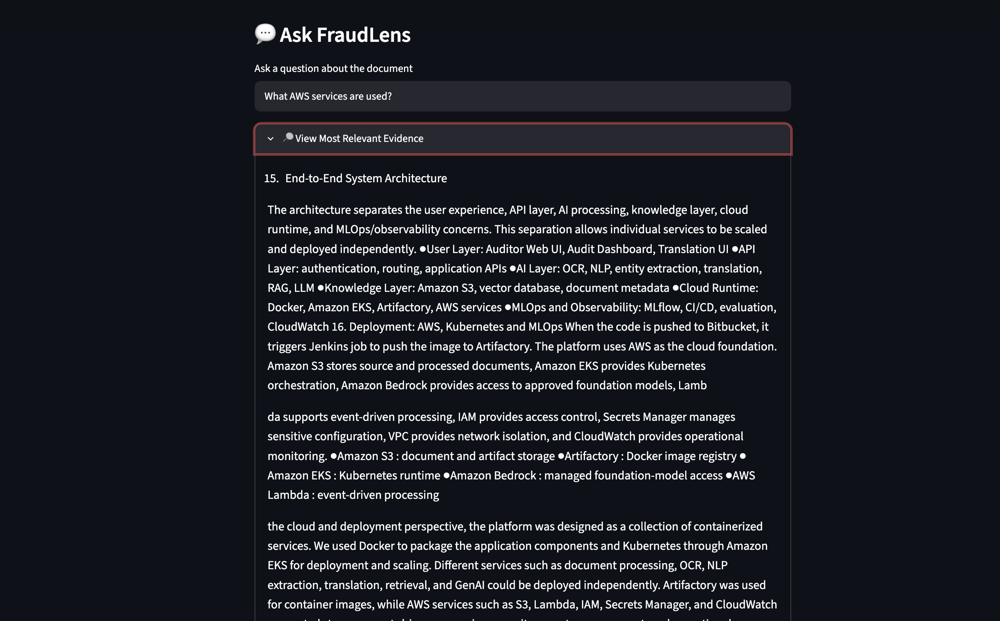

# 🔍 FraudLens

FraudLens is an AI-powered fraud document intelligence platform designed to analyze business documents and help identify important information for fraud investigation.

The application combines document processing, OCR, NLP, semantic search, and Generative AI to extract information from PDF documents and allow users to ask questions about their contents.
## 📸 Demo

## 🚀 Features

- PDF document upload and processing
- OCR support for scanned PDF documents using Tesseract
- Automatic text extraction using PyMuPDF
- Fraud-related entity extraction
- Amount detection
- Date detection and normalization
- Location detection
- Person and organization extraction using spaCy
- Document chunking
- Sentence Transformer embeddings
- Semantic similarity search
- Retrieval-Augmented Generation (RAG)
- Gemini-powered document question answering
- Source page references for retrieved evidence
- Document analysis summary

## 🧠 How It Works

1. User uploads a PDF document.
2. FraudLens extracts text from the PDF.
3. Scanned pages are processed using OCR.
4. Important entities such as amounts, dates, locations, people, and organizations are extracted.
5. Document text is divided into smaller chunks.
6. Sentence Transformer embeddings are generated.
7. The user's question is converted into an embedding.
8. Semantic similarity identifies the most relevant document sections.
9. Relevant evidence is provided to Gemini.
10. FraudLens generates an answer based only on the retrieved document evidence and displays the relevant source pages.

## 🛠️ Tech Stack

- Python
- Streamlit
- PyMuPDF
- Tesseract OCR
- spaCy
- Sentence Transformers
- Gemini API
- NLP
- Retrieval-Augmented Generation (RAG)

## 📂 Project Structure

FraudLens/
├── app.py
├── requirements.txt
├── .gitignore
├── .env
└── README.md

> `.env` contains the Gemini API key and is excluded from GitHub using `.gitignore`.

## 🔐 Environment Variables

Create a `.env` file in the project directory and add:

GEMINI_API_KEY=your_api_key_here

Never commit your actual API key to GitHub.

## ▶️ Run the Application

Install the dependencies:

pip install -r requirements.txt

Run FraudLens:

streamlit run app.py

Then open the local Streamlit URL in your browser.

## 🔮 Future Improvements

Future versions can include:

- Multilingual document translation
- OCR bounding-box visualization
- Additional currency and transaction extraction
- Vector database integration
- Hybrid search and reranking
- Docker containerization
- AWS cloud deployment
- Kubernetes deployment
- MLOps monitoring

## 👩‍💻 Author

**Srinija Garapati**

M.S. Data Science  
University of North Texas